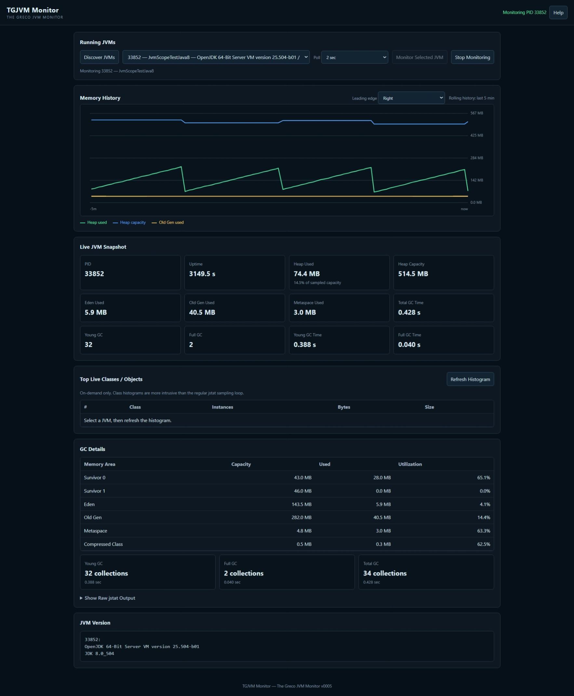

# TGJVM Monitor

**The Greco JVM Monitor**

A lightweight browser-based JVM monitoring workspace for quickly inspecting a running Java Virtual Machine using standard JDK diagnostic tools and a small local PowerShell bridge.

TGJVM Monitor keeps the user interface in a standalone HTML file. A companion PowerShell script exposes a small localhost-only HTTP bridge that translates predefined browser requests into standard JDK tools such as `jps`, `jcmd`, and `jstat`.

> **Start the bridge. Pick a JVM. Watch the runtime live.**



## Run TGJVM Monitor

**[▶ Open TGJVM Monitor in your browser](https://mikejamesgreco.github.io/tgjvm-monitor/)**

TGJVM Monitor can also be opened directly from the standalone `tgjvm-monitor.html` file.

Unlike a purely browser-local application, TGJVM Monitor needs access to operating-system-level JVM diagnostic tools. That access is provided by the companion `tg-jvm-bridge.ps1` script running on the same Windows machine as the target JVM.

---

## Why TGJVM Monitor?

Java developers and system administrators often need a quick answer to questions such as:

- Which JVMs are running on this machine?
- Which Java version is a process using?
- Is heap usage climbing?
- Is Old Gen steadily increasing?
- How often is garbage collection running?
- How much time is being spent in GC?
- Which classes currently consume the most heap?
- Is a JVM showing signs that justify deeper profiling?

Traditional tools can answer these questions, but they may require installing a desktop application, enabling remote management, adding an agent, configuring JMX, or standing up a monitoring stack.

TGJVM Monitor takes a smaller approach.

```text
Running JVM
    │
    ▼
jps / jcmd / jstat
    │
    ▼
tg-jvm-bridge.ps1
    │
    │  localhost:32032
    ▼
┌──────────────────────────────┐
│        TGJVM Monitor         │
│                              │
│  Discover     Monitor        │
│  Graph        Inspect GC     │
│  Histogram    Diagnose       │
│                              │
└──────────────────────────────┘
```

The target Java application does not need to be modified or instrumented by TGJVM Monitor.

---

## Core Principles

TGJVM Monitor is designed around a few simple principles:

- **Fast startup** — launch the bridge, open the HTML, and select a JVM.
- **Local monitoring** — the bridge binds to the local loopback interface.
- **Standard JDK tooling** — use JVM diagnostic capabilities already provided by the JDK.
- **No application agent required** — the monitored application does not need TGJVM-specific code.
- **Standalone browser UI** — the monitoring application is distributed as one HTML file.
- **No JavaScript framework dependency** — the UI uses browser-native HTML, CSS, JavaScript, Canvas, and `fetch()`.
- **Controlled command surface** — browser URLs map to predefined monitoring operations rather than arbitrary shell commands.
- **Lightweight first** — inexpensive polling is separated from heavier on-demand diagnostics.
- **Developer and administrator visibility** — metrics are presented with explanations of why they matter.

---

## Requirements

TGJVM Monitor currently targets a simple local Windows development or administration workflow.

You need:

- A Windows machine
- PowerShell
- A JDK installed
- `jps`, `jcmd`, and `jstat` available from the JDK
- A target JVM that the current Windows user is permitted to inspect
- A modern desktop browser such as Microsoft Edge or Google Chrome

The bridge resolves JDK tools from the current `PATH`.

You can verify the basic environment from Command Prompt with:

```bat
java -version
jps -l
```

---

## Getting Started

1. Place these files together:

```text
tgjvm-monitor.html
tg-jvm-bridge.ps1
```

2. Start the bridge from Command Prompt:

```bat
powershell -ExecutionPolicy Bypass -File .\tg-jvm-bridge.ps1
```

3. Open `tgjvm-monitor.html` in a browser, or open the hosted TGJVM Monitor.

4. Choose **Discover JVMs**.

5. Select the JVM you want to inspect.

6. Choose **Monitor Selected JVM**.

The bridge listens on:

```text
http://localhost:32032
```

The browser communicates with that local bridge using normal HTTP `fetch()` calls.

---

## JVM Discovery

TGJVM Monitor first asks the bridge for the JVMs currently visible to the JDK tools.

The bridge uses:

```text
jps -l
```

and enriches discovered JVMs with runtime information from:

```text
jcmd <pid> VM.version
```

The browser can therefore present a JVM selector containing information such as:

```text
33852 — JvmScopeTestJava8 — OpenJDK 64-Bit Server VM / JDK 8.0_504
```

The temporary `jps` process itself is filtered from the discovery list.

---

## Polling Interval

The monitoring view supports selectable polling intervals:

- 1 second
- 2 seconds
- 5 seconds
- 10 seconds
- 30 seconds

The default is **2 seconds**.

The normal monitoring loop intentionally focuses on relatively lightweight statistics. More intrusive operations, such as generating a class histogram, remain on-demand.

---

## Memory History

TGJVM Monitor maintains a rolling memory history in the browser.

The current graph displays:

- Heap used
- Sampled heap capacity
- Old Gen used

The history is currently retained for approximately five minutes.

### Leading Edge

The graph supports either:

- **Right leading edge** — newest samples enter from the right
- **Left leading edge** — newest samples enter from the left

The Y-axis follows the selected leading edge so the current scale remains adjacent to the newest data.

This scope-style behavior makes it possible to choose whichever visual direction feels most natural for live monitoring.

---

## Live JVM Snapshot

The live snapshot provides quick visibility into common JVM health indicators, including:

- PID
- JVM uptime
- Approximate heap used
- Sampled heap capacity
- Eden used
- Old Gen used
- Metaspace used
- Young GC count
- Young GC time
- Full GC count
- Full GC time
- Total GC time

The values are derived from standard `jstat` and `jcmd` output returned by the bridge.

---

## Garbage Collection Details

TGJVM converts the raw `jstat -gc` output into a readable table covering:

- Survivor 0
- Survivor 1
- Eden
- Old Gen
- Metaspace
- Compressed Class Space

For each applicable memory area, the monitor displays:

- Capacity
- Used
- Utilization

A compact summary also shows:

- Young GC collection count and elapsed time
- Full GC collection count and elapsed time
- Total GC collection count and elapsed time

The original raw `jstat` response remains available under **Show Raw jstat Output** for troubleshooting and verification.

---

## Top Live Classes / Objects

TGJVM can request an on-demand class histogram from the selected JVM.

The bridge maps the request to:

```text
jcmd <pid> GC.class_histogram
```

The monitor displays the top classes by live bytes and includes:

- Friendly class name
- Instance count
- Raw bytes
- Human-readable size

JVM descriptor names are translated for readability. Examples include:

```text
[B                   -> byte[]
[I                   -> int[]
[C                   -> char[]
[Ljava.lang.Object;  -> java.lang.Object[]
[[B                  -> byte[][]
```

The histogram is deliberately **not** part of the frequent polling loop because generating a class histogram can be more intrusive than reading normal JVM performance counters.

---

## Why the Metrics Matter

TGJVM includes built-in Help that describes each major metric from both a developer and system-administrator perspective.

Examples:

### Heap Used

A rising heap is not automatically a problem. The important pattern is often whether memory drops after garbage collection.

For developers, a steadily rising post-GC baseline may indicate retained objects or a leak.

For administrators, sustained heap pressure can indicate an approaching capacity or stability problem.

### Old Gen

Old Gen contains objects that have survived long enough to be promoted.

A steadily rising Old Gen baseline is often more interesting than short-lived Eden growth.

### Eden

Most newly allocated objects begin in Eden.

Frequent growth and reset is expected, but very heavy churn can correlate with high young-GC activity and CPU overhead.

### Metaspace

Metaspace stores class metadata outside the ordinary Java object heap.

Unexpected growth can indicate heavy dynamic class generation or class-loader retention.

### Young GC

Young collections primarily clean short-lived allocations.

Increasing collection frequency or accumulated time may point to allocation pressure.

### Full GC

Full or major collections can be substantially more disruptive.

Repeated Full GC activity, particularly alongside rising Old Gen, deserves investigation.

### Class Histogram

The class histogram identifies which live object types currently dominate memory.

It can help focus a developer's investigation before moving to a heap dump, Java Flight Recorder, or a full profiler.

---

## Built-In Help

Choose **Help** from the application header for explanations of:

- Poll interval
- Heap used
- Heap capacity
- Eden
- Survivor spaces
- Old Gen
- Metaspace
- Compressed Class Space
- Young GC
- Full GC
- GC elapsed time
- Memory-history graph
- Leading edge
- Top live classes
- The local JVM bridge
- Monitoring scope and limitations

The goal is for the dashboard to be useful both to someone who already understands JVM internals and to someone diagnosing a Java process without living in JVM tooling every day.

---

## Bridge Commands

The bridge exposes a deliberately small HTTP command surface.

Discovery:

```text
http://localhost:32032/jvms
```

Selected JVM information:

```text
http://localhost:32032/version?pid=PID
http://localhost:32032/uptime?pid=PID
http://localhost:32032/flags?pid=PID
http://localhost:32032/properties?pid=PID
http://localhost:32032/commands?pid=PID
```

Live monitoring snapshots:

```text
http://localhost:32032/gc?pid=PID
http://localhost:32032/gcutil?pid=PID
http://localhost:32032/class?pid=PID
http://localhost:32032/compiler?pid=PID
http://localhost:32032/perfcounters?pid=PID
```

On-demand diagnostics:

```text
http://localhost:32032/threads?pid=PID
http://localhost:32032/histogram?pid=PID
```

Bridge control:

```text
http://localhost:32032/help
http://localhost:32032/shutdown
```

Replace `PID` with a JVM process ID returned by `/jvms`.

---

## Bridge Security Model

The bridge is intentionally constrained.

It:

- Binds to the loopback interface rather than all network interfaces
- Accepts predefined endpoint names
- Validates JVM PIDs
- Verifies the requested PID is currently present in JVM discovery
- Resolves known JDK tools internally
- Maps endpoints to fixed JDK operations
- Does **not** accept arbitrary shell command text from the browser

The bridge should still be treated as local diagnostic software and reviewed appropriately before use in sensitive or production environments.

---

## Stopping the Bridge

The bridge can be stopped from its console or through the local shutdown endpoint:

```text
http://localhost:32032/shutdown
```

The shutdown endpoint requests a graceful exit of the bridge loop.

---

## Standalone Browser Application

The primary UI is:

```text
tgjvm-monitor.html
```

The application contains its HTML, CSS, JavaScript, chart rendering, metric interpretation, class-name translation, and Help content in that single file.

No Node.js runtime, JavaScript package manager, frontend framework, CDN, or web application server is required to run the UI.

The PowerShell bridge exists because browser JavaScript cannot directly execute operating-system JDK tools.

---

## Repository Structure

A simple repository layout is:

```text
tgjvm-monitor/
│
├── index.html              # GitHub Pages launcher
├── tgjvm-monitor.html      # Standalone browser monitor
├── tg-jvm-bridge.ps1       # Local PowerShell/JDK bridge
├── screenshot.jpeg         # README screenshot
│
├── README.md
├── CHANGELOG.md
└── LICENSE
```

The exact structure may evolve as the project grows.

---

## Browser and Localhost Notes

TGJVM uses the browser's normal `fetch()` implementation to communicate with:

```text
http://localhost:32032
```

The bridge sends CORS headers for browser access.

Browser security behavior can vary by browser version and by whether TGJVM is opened as a local file or from an HTTPS-hosted page. The standalone local HTML is the simplest deployment model for the local bridge. If a hosted copy cannot reach the local bridge, open `tgjvm-monitor.html` directly from the local machine.

---

## JDK Compatibility

The initial TGJVM development and testing included a Temurin OpenJDK 8 JVM.

The bridge is designed around standard JDK diagnostic tools, but command availability and output can vary across JDK vendors and releases.

TGJVM should therefore treat the JDK's actual response as authoritative and degrade gracefully when a diagnostic command is unavailable.

Broader JDK-version regression testing is an appropriate ongoing project goal.

---

## What TGJVM Is Not

TGJVM is intended as a lightweight first-look monitoring and diagnostic tool.

It is not intended to replace:

- Java Flight Recorder
- Java Mission Control
- Heap-dump analyzers
- Full application profilers
- Production APM platforms
- Enterprise observability stacks

A useful workflow is:

```text
TGJVM
  │
  ├── Nothing unusual -> keep watching
  │
  └── Suspicious pattern
          │
          ▼
     deeper JVM tooling
```

TGJVM is designed to help a developer or administrator get oriented quickly and decide what deserves deeper investigation.

---

## Privacy

TGJVM does not require a TGJVM cloud service.

The browser communicates with the local bridge, and the bridge communicates with JVM tooling on the same machine.

Users should still consider:

- The sensitivity of JVM properties and thread information
- Whether the target process contains confidential application data
- Browser extensions
- Local machine policy
- Operating-system permissions
- Organizational rules for diagnostic tooling

when using TGJVM in sensitive environments.

---

## Project Status

TGJVM Monitor is an early public release and remains under active development.

The current release already provides an end-to-end workflow for JVM discovery, live memory and GC monitoring, rolling visualization, class histograms, and built-in metric guidance.

Future work may include additional CPU/thread metrics, richer diagnostics, longer history controls, export options, and broader JDK compatibility testing.

---

## Philosophy

TGJVM follows the same general lightweight application philosophy as the other Greco browser tools:

```text
No frontend framework.
No package manager.
No monitoring server stack.
No agent added to the target application.
No arbitrary remote-command endpoint.

Just a browser, a tiny local bridge, and standard JDK tooling.
```

---

## License

License information will be added to the repository's `LICENSE` file.

---

## Author

**Michael J. Greco**

TGJVM Monitor — **The Greco JVM Monitor**

© mikejamesgreco.me LLC. All rights reserved.
